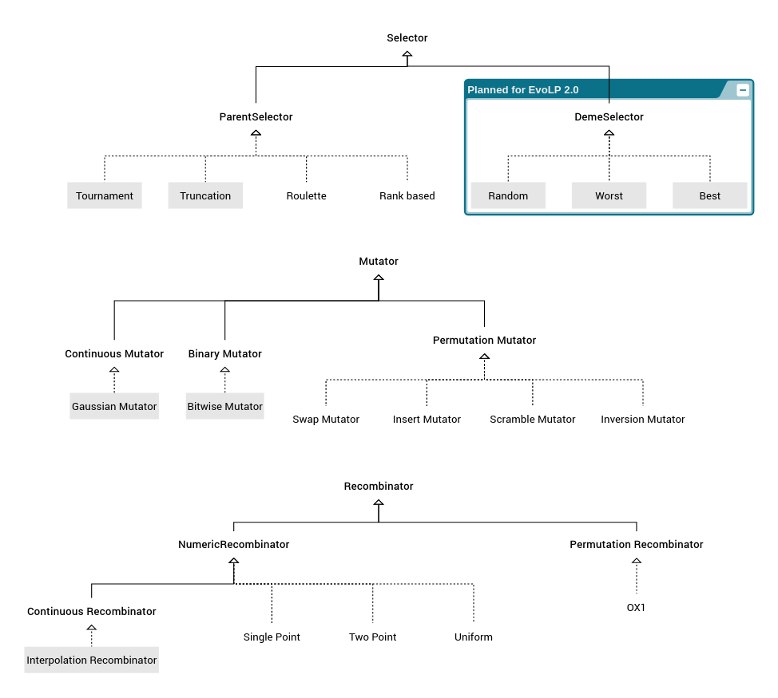

# Extending EvoLP

EvoLP was designed with extensibility in mind, by using Julia's dynamic dispatch ability to keep things simple.

We have 3 main functions (`select`, `cross` and `mutate`) which will perform differently depending on the parameters passed.
By passing a specific _type_, we ensure that the selection/recombination/mutation acts how we expect to.
The available type hierarchy in EvoLP.jl looks like the following:



In the image above, the abstract types are highlighted in bold font. The composite types (those you can instantiate) are marked with dotted lines, and those with parameters are bounded in a grey box.

## Creating your own blocks

If you want to experiment with new _building blocks_, you can create your own by using the _abstract_ block types as a supertype of your own selectors, mutators and recombinators.
These abstract blocks are the following:

```@autodocs
Modules = [EvoLP]
Public = false
Order = [:type]
```

The abstract types are **not exported** in EvoLP, which means that you will not see them if you used `using EvoLP` in your code.
You need to access them directly, by writing `EvoLP.<theabstractblock>`.

Once you have your own type, you need to explicitly code how the _block_ should operate. This is done by creating a new method of the [`select`](@ref), [`cross`](@ref) or [`mutate`](@ref) functions, depending on what your abstract supertype is.

After that, you can use the new blocks in your algorithms like any of the other built-in blocks.

## A hypothetical example

You can use the corresponding `AbstractType` to create a new mutation method called `MyCrazyMutation`.
This new mutator would work on a real-valued vector, so it should be a sub-type of the `ContinuousMutator` abstract type:

```julia
struct MyCrazyMutation <: EvoLP.ContinuousMutator
    param1
    param2
    param3
end
```

Then, we can code a new method for the `mutate` function, which will look something like the following:

```julia
function mutate(M::MyCrazyMutation, ind; rng=Random.GLOBAL_RNG)
    mutant = deepcopy(ind)
    if rand(rng) < param3
        mutant[1] = mutant[1] + M.param1
        mutant[2] = mutant[2] - M.param2
    end

    return mutant
end
```

This `MyCrazyMutation` method will then operate on a hypothetical 2-dimensional individual `ind`, and will change its first dimension by its `param1`, and the second dimension using `param2` if a random number is less than its `param3`.

Then, you can use it in your algorithms as if it was any other block. Here is a fake snippet for illustration purposes:

```julia
function myalgorithm(...)
    M = MyCrazyMutation(p1, p2, p3)
    ...
    mutate(M, ind)
    ...
end
```

## A word about randomisation

If using random numbers (for example in crossover or mutation operators) it is always a good idea to pass to your function a random number generator instance. In this way, your code can be used both for unit testing as well as for constructing shareable examples that are reproducible for the sake of science.
