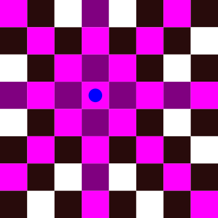
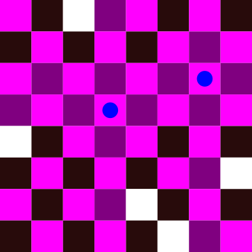
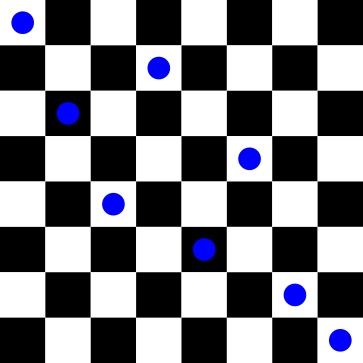

# Solving the 8-queens problem

This tutorial will showcase how to use some of the building blocks provided by LP to solve a combinatorial problem.

In this example,  we will solve the [8-queens puzzle](https://en.wikipedia.org/wiki/Eight_queens_puzzle).
This is a constraint satisfaction problem in which the goal is to place 8 queens in a chess board such that neither of them _check_ each other.



In the figure above, we have placed a queen represented by a blue dot. All conflicting cells have been highlighted. The problem becomes harder when we add more queens to the board:



## Implementing the solution

We can solve this problem using a **Genetic Algorithm (GA)** that deals with the constraints, using a steady-state approach and logging statistics on every iteration.

We will use the following modules:

```julia
using Statistics
using EvoLP
using OrderedCollections
```

### Dealing with constraints

To implement the solution, we need to handle the constraints in some way.
For this problem, we can divide the constraints in _vertical_, _horizontal_ and _diagonal_ clashes between the queens.

Interestingly enough, the vertical and horizontal clashes can be dealt with by using a vector of **permutations** where the _genes_ (index of the vector) represent a column and the _alleles_ (values the index can take) represent the row used in that column:



For the phenotype above, the genotype representation would look like this:

```julia
x = [1, 3, 5, 2, 6, 4, 7, 8]
```

The queen in the first column is in row 1. The queen in the second column is in row 3, and so on.

EvoLP contains a convenient `permutation_vector_pop`:

[`permutation_vector_pop`](@ref)

```julia
julia> @doc permutation_vector_pop
```

We can now use the generator to initialise our population:

```julia
pop_size = 100
population = permutation_vector_pop(pop_size, 8, 1:8)
first(population, 3)
```

```text
3-element Vector{Vector{Int64}}:
    [3, 7, 4, 8, 2, 1, 5, 6]
    [5, 4, 7, 6, 2, 3, 1, 8]
    [8, 6, 5, 1, 2, 3, 4, 7]
```

To deal with the _diagonal_ constraints, we can use the **fitness function**.

The penalty of a queen is the number of queens she can check.
The penalty of a board configuration would then be the sum of all penalties of all queens, and this is what we want to **minimise**. So let's build our fitness function step by step.

Assume a queen $q$ is in a position $(i, j)$. Then, we can define the diagonal neighbourhood as the following:

- Top-left: $(i-1, j-1)$
- Top-right: $(i-1, j+1)$
- Bottom-left: $(i+1, j-1)$
- Bottom-right: $(i+1, j+1)$

We can then use this information to iterate in all directions and check how many queens are there in the diagonals.

If we do this **for every queen** $q$, then we will count some of the clashes twice. It is a good idea to create a set of these clashes so that we can sum them afterwards.

```julia
function diag_constraints(x)
    # rows are values in x
    # columns are indices from 1:8
    fitness = []
    for q in 1:8
        tl = collect(zip(x[q]:-1:1, q:-1:1))
        tr = collect(zip(x[q]:-1:1, q:1:8))
        bl = collect(zip(x[q]:1:8, q:-1:1))
        br = collect(zip(x[q]:1:8, q:1:8))

        constraints = Set(vcat(tl, tr, bl, br))
        delete!(constraints, (x[q], q))
        q_fit = sum([(i, j) in constraints ? 1 : 0 for (i, j) in zip(x, 1:8)])
        push!(fitness, q_fit)
    end

    return sum(fitness)
end
```

To handle the corners and not specify "emtpy" diagonals, we consider the position $(i,j)$ of a queen to count as a "clash" itself.
This means that a queen in $(1,1)$ will consider $(1,1)$ as the top-left diagonal, and $(i,i), i \in [1,8]$ as the bottom-right diagonal (again, including itself). We later remove these additional constraints via `delete!` and proceed normally.

Using the same configuration as before, we have the following conflicting positions:


We can test our fitness function `diag_constraints` on this board and see the number of conflicts in total:

```julia
test = [1, 3, 5, 2, 6, 4, 7, 8]
diag_constraints(test)
```

```text
10
```

Going through each queen $q_i$ (with $i$ being the column number), we have the following number of conflicts:
$q_1 = 2$, $q_2 = 1$, $q_3 = 0$, $q_4 = 1$, $q_5 = 1$, $q_6 = 1$, $q_7 = 2$,  $q_8 = 2$

### Evolutionary operators

We now need to choose our evolutionary operators: what we will use for **selection**, **crossover** and **mutation**.

However, since we're dealing with permutations, we are restricted to use specific operators that do not end up destroying feasible solutions and therefore violate our constraints.
EvoLP contains some operators that can deal with permutation-based individuals:

```julia
julia> @doc TournamentSelectionSteady
```

```text
Tournament parent selection with tournament size `k`.
```

```julia
julia> @doc OrderOneCrossover
```

```text
Order 1 crossover (OX1) for permutation-based individuals.
```

```julia
julia> @doc SwapMutation
```

```text
Swap mutation for permutation-based individuals.
```

We can now _instantiate_ them and continue.

```julia
S = TournamentSelectionSteady(5);
C = OrderOneCrossover();
M = SwapMutation();
```

### Logging statistics

We can use the [`Logbook`](@ref) to record statistics about our run:

```julia
statnames = ["mean_eval", "max_f", "min_f", "median_f"]
fns = [mean, maximum, minimum, median]
thedict = LittleDict(statnames, fns)
thelogger = Logbook(thedict)
```

```text
Logbook(LittleDict{AbstractString, Function, Vector{AbstractString}, Vector{Function}}("mean_eval" => Statistics.mean, "max_f" => maximum, "min_f" => minimum, "median_f" => Statistics.median), NamedTuple{(:mean_eval, :max_f, :min_f, :median_f)}[])
```

### Constructing our own algorithm

And now we are ready to use all our building blocks to construct our own algorithm.
In this case, we will use a _steady-state_ GA: instead of replacing the whole population, we will generate a fixed amount of candidate solutions and keep the best $n$ individuals in the population each iteration.

Let's do a summary then:

- The representation is a **vector** of **permutations of integers** with values in the closed range $[1,8]$.
- To **select** the **parents**, we use the [`TournamentSelectionSteady`](@ref) operator with a tournament size of 5.
- To **recombine** the parents, we use the [`OrderOneCrossover`](@ref) operator.
- To **mutate** a candidate solution, we use the [`SwapMutation`](@ref) operator.
- To **select** the **survivors**, we _replace the worst_ individuals.
- With a **population size** `pop_size` of 100.
- With a **random initialisation** using the generator [`permutation_vector_pop`](@ref).
- We will use a **crossover probability** of 100%.
- And a **mutation probability** of 80%.

We can then build our algorithm in a function, and use EvoLP's [`Result`](@ref) type for the return:

```julia
function mySteadyGA(logbook, f, pop, k_max, S, C, M, mrate)
    n = length(pop)
    # Generation loop
    for _ in 1:k_max
        fitnesses = f.(pop)
        parents = select(S, fitnesses)  # this will return 2 parents
        parents = vcat(parents, select(S, fitnesses))  # Extend the list with 2 more parents
        offspring = [cross(C, pop[parents[1]], pop[parents[2]])]  # get first kid
        offspring = vcat(offspring, [cross(C, pop[parents[3]], pop[parents[4]])])  # get 2nd
        pop = vcat(pop, offspring) # add to population
        
        # Mutation loop
        for i in eachindex(pop)
            if rand() <= mrate
                pop[i] = mutate(M, pop[i])
            end
        end
        fitnesses = f.(pop)

        # Log statistics
        compute!(logbook, fitnesses)

        # Find worst and remove
        worst1 = argmax(fitnesses)
        deleteat!(pop, worst1)
        deleteat!(fitnesses, worst1)
        
        # And do the same again
        worst2 = argmax(fitnesses)
        deleteat!(pop, worst2)
        deleteat!(fitnesses, worst2)
    end

    # Result reporting
    best, best_i = findmin(f, pop)
    n_evals = 2 * k_max * n + n
    result = Result(best, pop[best_i], pop, k_max, n_evals)
    return result
end
```

To try our new algorithm, we just need to call its function with the appropriate arguments:

```julia
result  = mySteadyGA(thelogger, diag_constraints, population, 500, S, C, M, 0.8);
```

EvoLP provides convenient [functions](../man/results.md) that we can use to get information about a result:

```julia
@show optimum(result)
@show optimizer(result)
@show f_calls(result)
thelogger.records[end]
```

```text
optimum(result) = 0
optimizer(result) = Any[5, 1, 8, 6, 3, 7, 2, 4]
f_calls(result) = 100100


(mean_eval = 9.392156862745098, max_f = 20, min_f = 0, median_f = 8.0)
```

And this is just a helper function to visualise our result as a chess board:

```julia
function drawboard(x)
    b = fill("◻",8,8)
    for i in 1:2:8
        b[i,2:2:8] .= "◼"
    end
    for i in 2:2:8
        b[i, 1:2:8] .= "◼"
    end
    for (i,j) in zip(x,1:8)
        b[i, j] = "♛"
    end
    for i in 1:8
        println(join(b[i,:]))
    end
end
```

```julia
drawboard(optimizer(result))
```

```text
◻♛◻◼◻◼◻◼
◼◻◼◻◼◻♛◻
◻◼◻◼♛◼◻◼
◼◻◼◻◼◻◼♛
♛◼◻◼◻◼◻◼
◼◻◼♛◼◻◼◻
◻◼◻◼◻♛◻◼
◼◻♛◻◼◻◼◻
```
